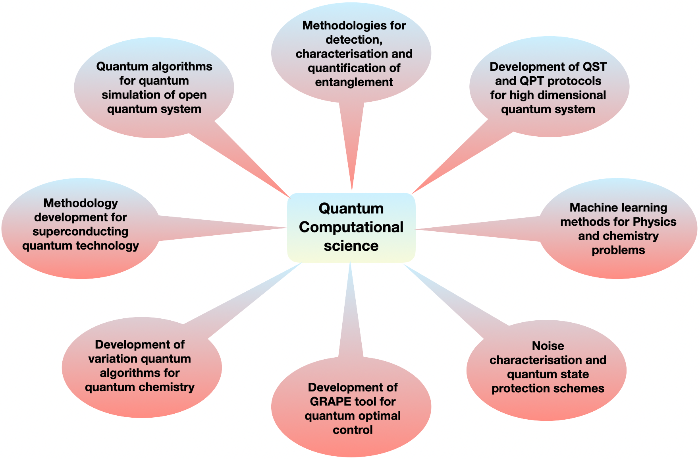

Research
==========================

::::
    
Standard tomography 
---------------------
.. list-table::
   :widths: auto
   :header-rows: 0

   * - .. image:: _static/toc_qst.pdf
         :width: 380
     - .. image:: _static/toc_qpt.pdf
         :width: 370

The reliability of a quantum processor is primarily dependent on the experimentally prepared initial states 
(input) in which the information is encoded along with the experimentally implemented quantum gates
(process) which are used to process the information and finally the measurement process
carried out to extract the information from unknown quantum state (output). Hence
characterizing quantum states and quantum processes via efficient measurement techniques in 
such devices is essential to evaluating their performance which is typically done
using quantum state tomography (QST) and quantum process tomography (QPT)
methods.   

Both QST and QPT are statistical processes which comprise two basic elements: (i) a set
of measurements and (ii) an estimator which maps the outcomes of the measurements to
an estimate of the unknown state or process. Since in reality the ensemble size is finite
and systematic errors are inevitable, there is always some ambiguity associated with the
estimation of an experimentally created and tomographed state, which often leads to an
unphysical density matrix (or process) reconstruction using standard methods where the
positivity condition is not explicitly included.

::::

Tomography with reduced data
--------------------------------------

.. rubric:: Compressed sensing
.. image:: _static/toc_csqst.pdf
    :width: 500
    :align: center

Compressed sensing (CS) methods work well if the target matrix is sparse in some known 
basis. The CS algorithm provides a way to reconstruct the complete
and true density (process) matrix from a drastically reduced data set, provided that 
the  matrix is sufficiently sparse in some known basis i.e. , the number of nonzero entries in the
matrix is small where the sparsity is a property of the state representation and
not the state itself.

.. rubric:: Artificial neural network model
.. image:: _static/ann.pdf
    :width: 500
    :align: center

Recently, a promising class that draws inspiration
from data-driven approaches and machine learning (ML)
methods has been applied to a variety of quantum information processing tasks including QST and QPT.
These techniques have shown to be computationally faster and more effective than the standard
schemes and able to estimate the entire density (process) matrix in a reasonable time. Such methods include 
variational algorithm approach, adaptive Bayesian
tomography, and self-guided QST, deep learning models: feed-forward neural networks (FFNNs), 
convolutional neural networks (CNNs), conditional generative adversarial networks (CGANs), restricted Boltzmann machines (RBMs).
In the figure a simple FFNN model for QST is shown.

::::

Selective and direct tomography
---------------------------------

.. rubric:: Weak measurement approach
.. image:: _static/toc_weakqpt.pdf
    :width: 300
    :align: center

Weak measurement approach is very well explored to carry our direct quantum tomography.
The scheme allows us to compute desired elements of the density matrix and is designed in such a 
way that it does not require any ancillary qubits and has reduced complexity as compared to 
traditional weak measurement-based DQST and DQPT methods. The scheme shown in figure has three
major advantages, namely (i) it does not require sequential weak measurements, (ii) it
does not involve implementation of complicated error-prone quantum gates such as a multi-qubit, 
multi-control phase gate and (iii) it does not require projective measurements. Furthermore, 
method is experimentally feasible as it requires a single experiment to determine multiple 
selective elements of the density/process matrix. Also the scheme is general and can be applied to any 
circuit-based implementation. 

.. rubric:: selective QPT using quantum 2-design states
.. image:: _static/toc_seqpt.pdf
    :width: 300
    :align: center

Selective estimation of desired elements
of process matrix using concepts of quantum 2-design states and average survival probability is shown in the figure. 
The scheme is generalized in such way that it can be implemented efficiently
using only a set of local measurements involving product operators. The method allows
to estimate any element of the quantum process matrix to a desired precision, provided a
set of quantum states can be prepared efficiently. As opposed to the standard implemen-
tation of selective and efficient quantum process tomography (SEQPT) which involves the
preparation and complete characterization of a large number of quantum states, the local 
measurement-based technique requires much fewer experimental resources as it avoids
complete characterization of the states and allows to compute specific elements of the process
matrix by a restrictive set of sub-system measurements.

.. Quantum simulation
.. ------------------

.. to be added