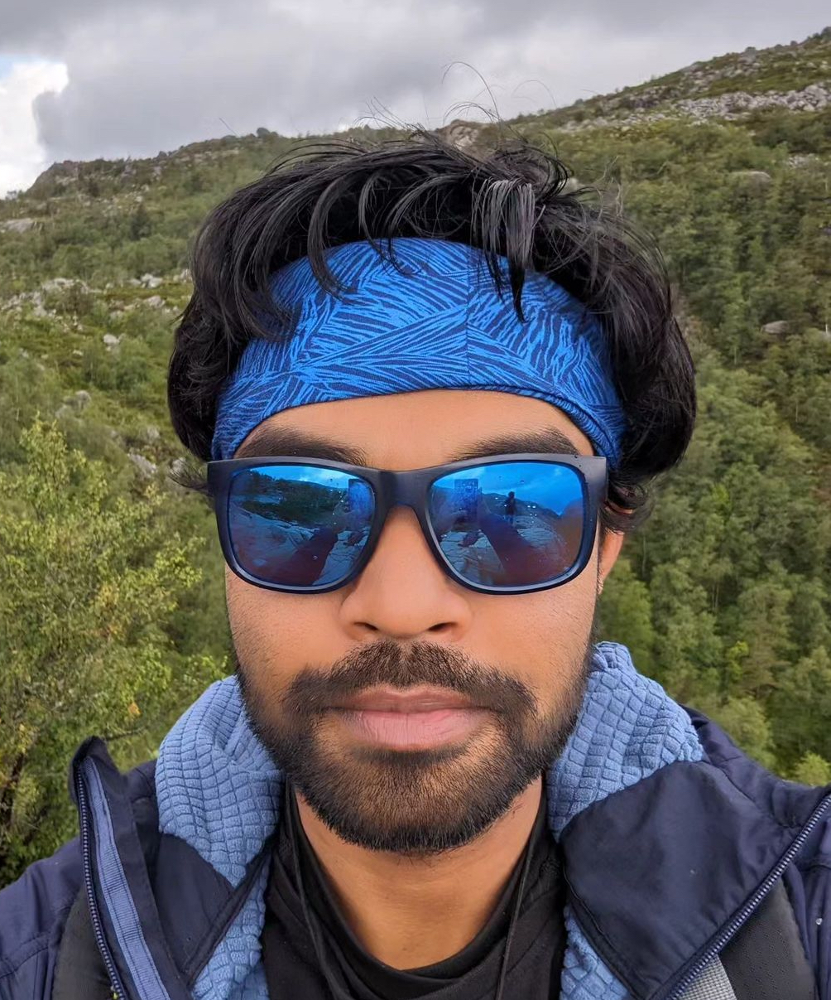

.. Akshay website master file, created by
   sphinx-quickstart on Thu Oct 15 14:40:32 2020.
   You can adapt this file completely to your liking, but it should at least
   contain the root `toctree` directive.

Akshay Gaikwad
================

  
I am currently a postdoc researcher, working with `Anton Frisk Kockum <https://antonfriskkockum.wixsite.com/research>`_, in the `Applied Quantum Physics Laboratory <https://www.chalmers.se/en/departments/mc2/research/applied-quantum-physics/>`_ division, in the Department of Microtechnology and Nanoscience at Chalmers University of Technology, in Gothenburg, Sweden. 

I did my Ph.D. under the supervision of `Prof. Kavita Dorai <https://web.iisermohali.ac.in/dept/physics/Kavita_Dorai.html>`_ and `Prof. Arvind <https://web.iisermohali.ac.in/Faculty/arvind/>`_
at the `IISER Mohali <https://www.iisermohali.ac.in>`_ , India. 
My thesis dissertation, titled `Novel techniques for efficient quantum state tomography and quantum process tomography and their experimental implementation <https://arxiv.org/abs/2401.09941>`_, focused on advancing methods in quantum state and process tomography. 

..
    figure:: _static/test3.jpg
    :figwidth: 250
    :align: right
    
    Image generated with `WordCloud <https://github.com/amueller/word_cloud>`_ from my arXiv abstracts.

 
My research interests are:

- Quantum state tomography
- Quantum process tomography 
- Quantum optimal control
- Quantum computing with superconducting qubits and nuclear spin qubits

|

If you are an experimentalist in quantum computing 
and are interested in performing tomography for your systems (discrete or continuous), 
I would be happy to discuss potential collaborations. Theorists are also welcome 
to reach out for collaborative opportunities.

------------

.. toctree::
    :maxdepth: 5
    :hidden:
    :caption: My research webpage:
    
    CV
    Publications
    Research
    Conferences
    Contact

